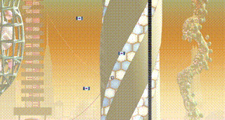

# Hookline

Hookline is a 2D platformer where you use a grappling hook to move
around a futuristic city. Your goal is to avoid hazards, figure out
where to go, and use your grappling hook and boosts to get you up and to your goal.

## Gameplay

**Controls**

- W/A/D - control movement, stronger while grappling
- Mouse click (hold) - attach and hold grapple

## Download
- [Windows](https://github.com/judemarkabawi/hookline/actions/runs/12174188480/artifacts/2277559071)
- [Linux](https://github.com/judemarkabawi/hookline/actions/runs/12174188480/artifacts/2277535172)
- [MacOS]()